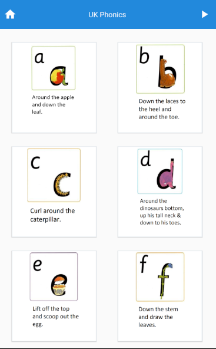
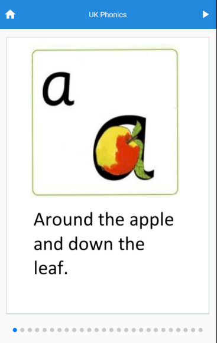
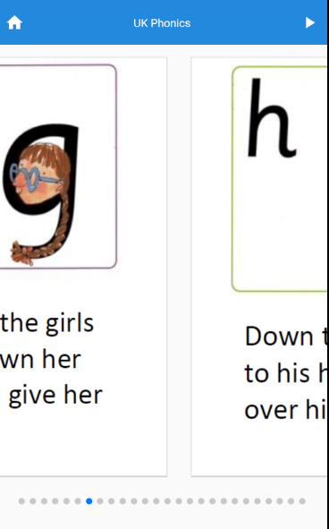

# UK Phonics Mobile App

A Simple and free UK Phonics mobile app which has all alphabets.

# Features

- List of Phonics cards
- Autoplay Phonics cards
- Manual Swipe of cards

# Screenshots

# Supported Device

- Android - Mobile and Tab
- ios - Mobile and Tab(not ready yet)

# Technologies

- React Native
- React Native Element - UI lib
- React Native Swiper - for swiping/playing the cards
- React Native Super grid - for display the cards in nice grid format

# TODOs

- Add Splash/Loading screen
- Add tests
- Setup Github Actions for tests
- Setup Github Actions for Deploy to Playstore
- Ios support
